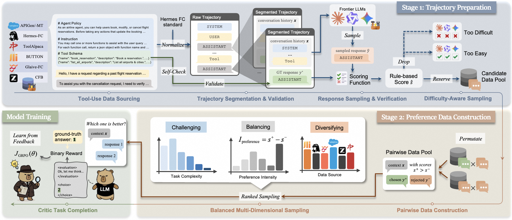
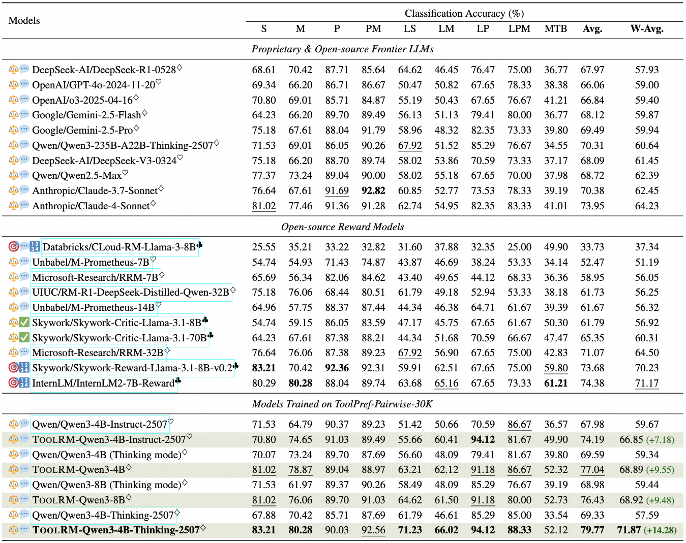

<!-- # ToolRM: Towards Agentic Tool-Use Reward Modeling -->

<p align="center">
  
</p>

<p align="center">
  🤗 <a href="https://huggingface.co/collections/RioLee/toolrm">HF Collection</a>&nbsp;&nbsp;|&nbsp;&nbsp;
  📄 <a href="https://arxiv.org/abs/2510.26167">Paper</a>&nbsp;&nbsp;&nbsp;
</p>

## :star2: Overview

**ToolRM** is a family of lightweight generative and discriminative RMs tailored for agentic tool-use scenarios. To build these models, we propose a novel pipeline that constructs pairwise preference data using rule-based scoring and multidimensional sampling. This yields *ToolPref-Pairwise-30K*, a diverse, balanced, and challenging dataset of critique tasks that supports reinforcement learning with verifiable feedback. To evaluate tool-use RMs, we also introduce **TRBench-BFCL**, a benchmark built on the agentic evaluation suite [BFCL](https://gorilla.cs.berkeley.edu/blogs/13_bfcl_v3_multi_turn.html). Trained on our constructed data, models from the Qwen3-4B/8B series outperform several giant LLMs in pairwise reward judgments. Beyond training objectives, ToolRM generalizes to broader critique tasks, including Best-of-N sampling and self-correction. It also supports downstream RL training effectively.

<div align="center">


*Figure 1: An overview of ToolRM framework.*

</div>

## :newspaper: News

- [2026-01-14]: We update our paper with additional experimental results.
- [2025-11-10]: Datasets and ToolRM model checkpoints have been released in this [huggingface collection](https://huggingface.co/collections/RioLee/toolrm).

## :rocket: Quick Start

### Resource Preparation

- Download [ToolPref-Pairwise-30K](https://huggingface.co/datasets/RioLee/ToolPref-Pairwise-30K) to train ToolRM, [TRBench-BFCL](https://huggingface.co/datasets/RioLee/TRBench-BFCL) to evaluate reward models in the general tool-use scenarios, and [ToolRM checkpoints](https://huggingface.co/RioLee/ToolRM-Qwen3-4B-Thinking-2507) to directly facilitate your agentic tool-use research.
- Note that we respectively use the `think` and `no_think` prompt templates to create the GenRM-formatted datasets. Please ensure you select the appropriate dataset for both training and evaluation based on whether the target LLM is a reasoning or non-reasoning model.

### Environment Setup

1. **Install `verl`**: Clone from the [verl](https://github.com/volcengine/verl) repository for generative ToolRM training. Set up `verl` within a dedicated Python virtual environment (e.g., using `conda` or `venv`). Follow the official [verl installation guide](https://verl.readthedocs.io/en/latest/start/install.html) to ensure all prerequisites:

    ```bash
    git clone https://github.com/volcengine/verl
    ```

2. **Install `OpenRLHF`**: Clone from the [OpenRLHF](https://github.com/OpenRLHF/OpenRLHF) repository for discriminative ToolRM training:

    ```bash
    git clone https://github.com/OpenRLHF/OpenRLHF
    ```

3. **Activate Environment**: Ensure your `verl` virtual environment is active in your current terminal session.

    ```bash
    conda activate <your_venv_name> # Example if using conda
    # source <your_venv_path>/bin/activate # Example if using venv
    ```

### ToolRM-Gen Model Training

1. **Prepare Training Files**:
    - Copy the custom reward function script into the `verl` library structure:

        ```bash
        cd <your_toolrm_project_root_path>
        cp train/toolrm_reward_function.py <your_verl_project_root_path>/verl/utils/reward_score/
        ```

    - Copy the training configuration script `train_toolrm_gen.sh` to the `verl` examples directory:

        ```bash
        cp scripts/train_toolrm_gen.sh <your_verl_project_root_path>/examples/grpo_trainer/
        ```

2. **Execute Training**: Navigate to the `verl` directory and run the training script:

    ```bash
    cd <your_verl_project_root_path>
    bash examples/grpo_trainer/train_toolrm_gen.sh
    # FSDP model checkpoints are converted to Huggingface-compatible checkpoints after training.
    ```

### ToolRM-Disc Model Training

1. **Prepare Training Files**: Copy the training configuration script `train_toolrm_disc.sh` to the `openrlhf` example scripts directory:

    ```bash
    cp scripts/train_toolrm_disc.sh <your_openrlhf_project_root_path>/examples/scripts/
    ```

2. **Execute Training**: Navigate to the `openrlhf` directory and run the training script:

    ```bash
    cd <your_openrlhf_project_root_path>
    bash examples/scripts/train_toolrm_disc.sh
    ```

### Evaluation on TRBench-BFCL

1. **Prepare Evaluation Script**: Ensure the evaluation script `scripts/eval_trbench_*.sh` is correctly configured with the paths to checkpoints of your trained model or any baseline models you wish to evaluate.
2. **Run Evaluation**: Execute the script for evaluation on local-deployed models (default with `vllm` inference backend):

- To evaluate generative reward models:

    ```bash
    cd <your_toolrm_project_root_path>
    bash scripts/eval_trbench_genrm.sh
    ```

- To evaluate discriminative reward models:
    ```bash
    cd <your_toolrm_project_root_path>
    bash scripts/eval_trbench_discrm.sh
    ```

Evaluation results of several proprietary and open-source LLMs on TRBench-BFCL are shown as follows:

<div align="center">


*Figure 2: Evaluation results of reward models on TRBench-BFCL.*

</div>

---

## :vertical_traffic_light: License

ToolRM is a research project developed by Alibaba Cloud and licensed under the CC BY-NC-SA 4.0 License.

## :pray: Acknowledgments

Thanks to the [APIGen](https://huggingface.co/datasets/Salesforce/xlam-function-calling-60k), [APIGen-MT](https://huggingface.co/datasets/Salesforce/APIGen-MT-5k), [BUTTON](https://github.com/PKU-Baichuan-MLSystemLab/BUTTON/tree/main/data), [ComplexFuncBench](https://huggingface.co/datasets/zai-org/ComplexFuncBench), [Glaive-Function-Calling](https://huggingface.co/datasets/glaiveai/glaive-function-calling-v2), [Hermes-Function-Calling](https://huggingface.co/datasets/NousResearch/hermes-function-calling-v1), [ToolAlpaca](https://github.com/tangqiaoyu/ToolAlpaca/tree/main/data) and [BFCL](https://github.com/HuanzhiMao/BFCL-Result) projects for open-source tool call trajectory data.

## :pencil: Citation

```bibtex
@misc{li2026toolrmagentictoolusereward,
      title={ToolRM: Towards Agentic Tool-Use Reward Modeling}, 
      author={Renhao Li and Jianhong Tu and Yang Su and Yantao Liu and Fei Huang and Hamid Alinejad-Rokny and Derek F. Wong and Junyang Lin and Min Yang},
      year={2026},
      eprint={2510.26167},
      archivePrefix={arXiv},
      primaryClass={cs.AI},
      url={https://arxiv.org/abs/2510.26167}, 
}
```
